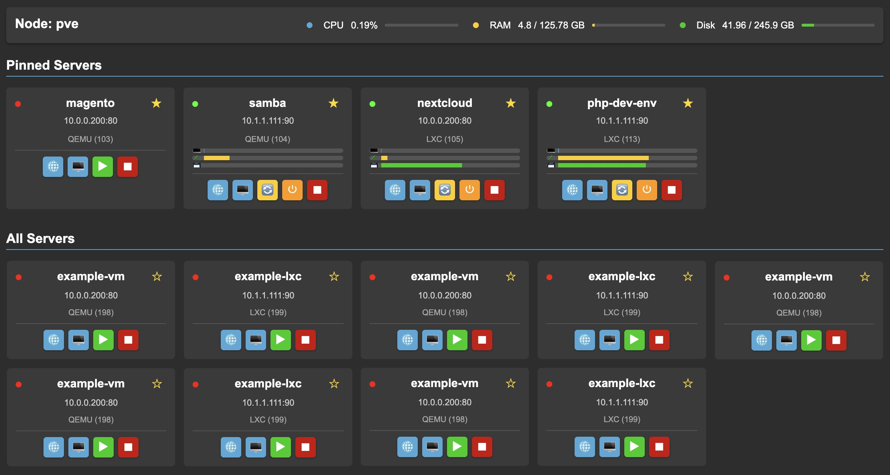

# Proxmox Dashboard

A simple dashboard that auto-populates your VMs and LXC containers from your Proxmox instance into a clean user interface. Uses the Proxmox API to pull your machine data.

- Each node has it's own card and is sorted by VMID
- Pin favourites to a top bar
- View the running status
- View close to realtime metrics (CPU/RAM/Disk usage)
- Action bar to easily manage / access the node:
    - Start / Restart / Shutdown / Stop (confirmation if running)
    - Connect to web address, or SSH
        - Edit your Proxmox LXC/VM note as follows:
        - IP: x.x.x.x Port: xxxx (SSHPort: xxxx - optional)

- Settings Menu for your preferences
  - Light / Dark mode

# Installation

- Place this into a 'proxboard' directory in your web server node (_e.g: /var/www/html/proxboard_) and make sure it is accessible via HTTP.

- Move config.php safely out of public reach into _/etc/proxmox-dashboard/config.php_ and edit it with your Proxmox IP, credentials and node name.

- You can then access the dashboard by navigating to `http://your-server-ip/proxboard/dashboard.php`.

## Troubleshooting

Ensure www-data (or relevant web user) has write access to the pinned.json, settings.json and debug.log files

E.G:
- _sudo chmod 664 /var/www/html/proxboard/pinned.json settings.json debug.log_
- _sudo chown www-data:www-data /var/www/html/proxboard/pinned.json settings.json debug.log_

Check debug.log if any critical errors occur

## Notes

Just a simple bookmark page for now to keep track of, manage and access your machines.
